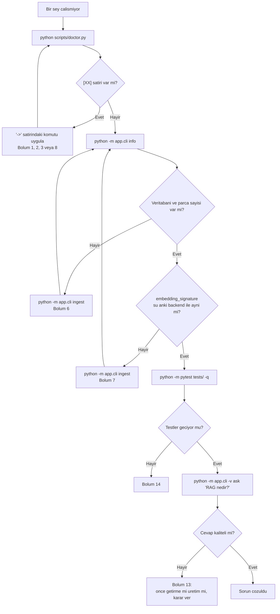

# Sorun Giderme

Bu dosya, projede gercekten karsilasilan hatalari **belirti -> sebep -> cozum**
sirasiyla anlatir. Her maddenin basinda gordugun ekran ciktisi vardir; once o
ciktiyi bu sayfada ara, sonra oku.

**Altin kural:** hata alinca ilk komut her zaman sudur.

```bash
python scripts/doctor.py
```

`doctor.py` sirasiyla islemci mimarisini, Python surumunu, hangi SDK kusaginin
kurulu oldugunu, numpy/streamlit'i ve Foundry Local katalogunun model
alias'larini kontrol eder. Cikti satirlari uc isaretten biriyle baslar:

| Isaret | Anlami |
| --- | --- |
| `[ok]` | Sorun yok |
| `[!!]` | Uyari; proje calisir ama sinirli calisir |
| `[XX]` | Hata; duzeltmeden Foundry Local calismaz |

`[XX]` satirlarinin altindaki `->` satiri, calistiracagin komutu verir.
`doctor.py` bir veya daha fazla `[XX]` bulursa cikis kodu `1` doner.

## Hizli tablo

| Gordugun mesaj | Bolum |
| --- | --- |
| `cannot import name 'Configuration' from 'foundry_local_sdk'` | [1](#1-cannot-import-name-configuration-from-foundry_local_sdk) |
| `Foundry Local SDK 1.x requires Python >= 3.11` | [2](#2-foundry-local-sdk-1x-requires-python--311) |
| `No matching distribution found for foundry-local-sdk` | [3](#3-no-matching-distribution-found-for-foundry-local-sdk) |
| `IndexError: list index out of range` (streaming sirasinda) | [4](#4-indexerror-list-index-out-of-range--streaming-dongusunde) |
| Baslangicta `...-generic-cpu` yaziyor, cevaplar yavas | [5](#5-generic-cpu-varyanti-yukleniyor-model-yavas-calisiyor) |
| `Veritabani bos. Once belgeleri indeksle` | [6](#6-veritabani-bos-once-belgeleri-indeksle) |
| `Indeks farkli bir embedding modeliyle olusturulmus` | [7](#7-indeks-farkli-bir-embedding-modeliyle-olusturulmus) |
| `Model alias '...' is not in the catalog on this machine` | [8](#8-model-alias--is-not-in-the-catalog-on-this-machine) |
| Ilk calistirma dakikalarca suruyor | [9](#9-ilk-calistirma-cok-uzun-suruyor--internet-gerekiyor-mu) |
| `Foundry Local could not start: ...` (Streamlit'te) | [10](#10-foundry-local-could-not-start--streamlit-yeniden-yuklendiginde) |
| `zsh: killed` / sistem donuyor | [11](#11-zsh-killed-bellek-yetersiz) |
| `foundry model list` embedding modelini gostermiyor | [12](#12-brew-install-foundrylocal-eski-surum-kuruyor) |
| Turkce cevaplar kotu, kaynak vermiyor | [13](#13-turkce-cevap-kalitesi-dusuk) |
| `ModuleNotFoundError: No module named 'foundry_rag'` (pytest) | [14](#14-testler-gecmiyor) |

---

## 1. `cannot import name 'Configuration' from 'foundry_local_sdk'`

### Belirti

Kendi yazdigin bir betikte ya da bir notebook hucresinde:

```
ImportError: cannot import name 'Configuration' from 'foundry_local_sdk'
```

veya daha sik gorulen hali:

```
ModuleNotFoundError: No module named 'foundry_local_sdk'
```

Bu projenin icinden calistirdiginda ayni durum su mesaja donusur (kaynak:
`src/foundry_rag/backends/foundry.py`, `_import_sdk()`):

```
Found the LEGACY foundry-local-sdk 0.x (module 'foundry_local').
This project targets 1.x (module 'foundry_local_sdk').
Fix:  pip install --upgrade 'foundry-local-sdk>=1.2'
```

### Sebep

`foundry-local-sdk` adini paylasan **iki uyumsuz SDK kusagi** var:

| Surum | Import edilen modul | Python | Nasil calisir |
| --- | --- | --- | --- |
| 0.x (eski) | `foundry_local` | herhangi | HTTP istemcisi, `foundry` CLI gerekir |
| 1.x (guncel) | `foundry_local_sdk` | **>= 3.11** | surec icinde calisir, CLI gerekmez |

Python 3.10 ve altinda `pip install foundry-local-sdk` **hata vermez**. pip,
paketin `requires_python` alanina bakip sessizce eski **0.5.1** surumunu kurar.
Sonra `foundry_local_sdk` diye bir modul bulamazsin, cunku 0.5.1 `foundry_local`
kurar. API'ler tamamen farklidir.

Bu, projedeki 1 numarali tuzaktir.

### Cozum

Once hangi surumun kurulu oldugunu ogren:

```bash
pip show foundry-local-sdk | grep -i version
python -c "import sys; print(sys.version)"
```

Surum `0.` ile basliyorsa Python surumu de eskidir. Sirayla:

```bash
pip uninstall -y foundry-local-sdk
brew install python@3.12
/opt/homebrew/bin/python3.12 -m venv .venv
source .venv/bin/activate
pip install -r requirements.txt
python scripts/doctor.py
```

`doctor.py` ciktisinda su satiri gormelisin:

```
  [ok]  foundry-local-sdk 1.2.x (modul: foundry_local_sdk)
```

Hala `[XX]` goruyorsan [2. bolume](#2-foundry-local-sdk-1x-requires-python--311)
gec.

### Kontrol listesi

- [ ] `pip show foundry-local-sdk` 1.x gosteriyor
- [ ] `python -c "import foundry_local_sdk"` hatasiz calisiyor
- [ ] `python -c "import foundry_local"` **hata veriyor** (eski paket temizlenmis)

---

## 2. `Foundry Local SDK 1.x requires Python >= 3.11`

### Belirti

`python scripts/doctor.py` ciktisinda:

```
--- Python ---
  [XX]  python: 3.9.6 (/usr/bin/python3) -- Foundry Local SDK 1.x >= 3.11 istiyor
         -> brew install python@3.12 && /opt/homebrew/bin/python3.12 -m venv .venv && source .venv/bin/activate && pip install -r requirements.txt
```

`--backend foundry` ile calistirirsan CLI ayni sorunu su sekilde bildirir
(`app/cli.py` icindeki `main()`, cikis kodu **2**):

```
[backend hatasi] Foundry Local SDK 1.x requires Python >= 3.11, but this interpreter is 3.9.
macOS ships 3.9 as /usr/bin/python3 and pip will silently install the
incompatible 0.5.1 SDK instead of erroring.
Fix:  brew install python@3.12 && /opt/homebrew/bin/python3.12 -m venv .venv && source .venv/bin/activate
```

Varsayilan `--backend auto` ile ise hata degil, **uyari** alirsin ve proje
calismaya devam eder:

```
[!] Foundry Local kullanilamiyor, cevrimdisi yedek backend'e gecildi.
    Sebep: Foundry Local SDK 1.x requires Python >= 3.11, ...
    Ayrinti icin: python scripts/doctor.py
```

Bu uyariyi kacirirsan proje calisir ama gercek bir dil modeli **hic devreye
girmez**. Bunu nasil anlayacagini [13. bolumde](#13-turkce-cevap-kalitesi-dusuk)
anlatiyoruz.

### Sebep

macOS 14.6, `/usr/bin/python3` olarak **3.9.6** gonderir. Foundry Local SDK 1.x
en az 3.11 ister. Kontrol `src/foundry_rag/backends/foundry.py` icinde import'tan
once yapilir:

```python
if sys.version_info < (3, 11):
    raise BackendUnavailable(...)
```

Bu kontrol bilerek erken calisir: yoksa 3.9'da pip'in sessizce kurdugu 0.5.1
yuzunden cok daha kafa karistirici bir `ImportError` alirdin.

### Cozum

```bash
brew install python@3.12
/opt/homebrew/bin/python3.12 -m venv .venv
source .venv/bin/activate
python -V                      # Python 3.12.x yazmali
pip install -r requirements.txt
python scripts/doctor.py
```

**Neden 3.12, neden 3.13 degil:** numpy 2.5 artik 3.11'i desteklemiyor; 3.12 su
an hem SDK'nin hem numpy'nin sorunsuz calistigi surum.

Her yeni terminal penceresinde `source .venv/bin/activate` yapmayi unutma.
Unuttugunda sistem Python'una duser ve bu hatayi tekrar alirsin. Hangi
yorumlayicinin aktif oldugunu su komutla dogrula:

```bash
which python     # .../foundry-local-rag/.venv/bin/python olmali
```

### Yan not: sqlite uzantilari

Ayni bolumde su uyariyi gorebilirsin:

```
  [!!]  sqlite 3.x.y / uzanti yukleme: False
         -> sqlite-vec bu yorumlayicida kullanilamaz. Bu proje icin sorun degil:
            arama numpy ile kaba kuvvet yapiliyor.
```

Sistem Python'unda `sqlite3` baglantisinin `enable_load_extension` metodu yoktur,
yani `sqlite-vec` gibi uzantilar yuklenemez. Bu proje icin **sorun degil**:
`src/foundry_rag/retrieval.py` icindeki `cosine_similarity()` aramayi numpy ile
kaba kuvvet yapar. Birkac bin parcada bu tek bir matris carpimidir.

---

## 3. `No matching distribution found for foundry-local-sdk`

### Belirti

```
ERROR: Could not find a version that satisfies the requirement foundry-local-sdk (from versions: none)
ERROR: No matching distribution found for foundry-local-sdk
```

`doctor.py` ciktisinda ise:

```
--- Platform ---
  [!!]  islemci mimarisi: x86_64
         -> Foundry Local yalnizca macOS arm64 (Apple Silicon) icin wheel yayinliyor.
            Rosetta altinda calisan bir Python kullaniyorsan arm64 bir yorumlayiciya gec.
```

### Sebep

Iki ayri durum ayni mesaji uretir:

1. **Python 3.11+ ama x86_64.** macOS'ta Foundry Local yalnizca **arm64 (Apple
   Silicon)** icin wheel yayinlar. Intel Mac icin hicbir build yoktur. Rosetta
   altinda acilmis bir terminalde kurulan Python da kendini x86_64 olarak
   tanitir, dolayisiyla pip uygun wheel bulamaz.
2. **Python 3.10 veya altinda.** Bu durumda genelde bu mesaji almazsin; pip
   sessizce 0.5.1'e duser. Bkz. [1. bolum](#1-cannot-import-name-configuration-from-foundry_local_sdk).

### Cozum

Once mimariyi olc:

```bash
python -c "import platform; print(platform.machine())"   # arm64 olmali
arch                                                     # arm64 olmali
brew --prefix                                            # /opt/homebrew olmali
```

`brew --prefix` `/usr/local` donuyorsa Intel (Rosetta) Homebrew kullaniyorsun.
`/opt/homebrew` altindaki arm64 Homebrew ile yeniden kur:

```bash
/opt/homebrew/bin/brew install python@3.12
/opt/homebrew/bin/python3.12 -m venv .venv
source .venv/bin/activate
pip install -r requirements.txt
```

Terminal.app veya iTerm'de "Rosetta kullanarak ac" secenegi isaretliyse
kapatip terminali yeniden baslat.

**Gercek bir Intel Mac kullaniyorsan** Foundry Local'i calistiramazsin. Yapacak
bir sey yok; projeyi cevrimdisi yedek backend ile calistir:

```bash
python -m app.cli --backend hashing ingest
python -m app.cli --backend hashing ask "RAG nedir?"
```

Boru hattinin tamami (parcalama, vektor deposu, getirme, prompt kurma,
degerlendirme) calisir; yalnizca dil modeli yerine alintilayan bir yedek devreye
girer.

### Minimum surum notu

Foundry Local'in `libonnxruntime.dylib` dosyasi minimum **macOS 14.0** ister.
macOS 14.6 bu siniri ancak geciyor. Daha eski bir macOS'ta calistiramazsin.

---

## 4. `IndexError: list index out of range` — streaming dongusunde

### Belirti

Cevap ekrana **tamamen yazildiktan sonra** program cokuyor:

```
Traceback (most recent call last):
  File "benim_denemem.py", line 21, in <module>
    print(chunk.choices[0].delta.content, end="")
IndexError: list index out of range
```

### Sebep

`complete_streaming_chat()` akisinin **son parcasi bos bir `choices` listesiyle**
gelebiliyor. Microsoft'un kendi RAG tutorial'indaki dongu bu listeye kontrolsuz
indeksliyor ve tam da cevabi yazdirdiktan sonra `IndexError` ile cokuyor.

> Ust kaynak hata kaydi: **microsoft/Foundry-Local #905** — 2026-07-25 itibariyle
> **acik**. macOS arm64 + WebGPU + SDK 1.2.3 uzerinde uretilebiliyor.

### Bu depoda durum

Bu depodaki kod korumali. `src/foundry_rag/backends/foundry.py`,
`FoundryBackend.stream_chat()`:

```python
for chunk in stream:
    if not getattr(chunk, "choices", None):
        continue
    delta = getattr(chunk.choices[0], "delta", None)
    content = getattr(delta, "content", None) if delta else None
    if content:
        yield content
```

Yani `python -m app.cli chat` bu hatayi vermez. Hatayi **kendi betigini yazan
ogrenci** alir.

### Cozum

Kendi kodunda ayni deseni kullan. Uc ayri koruma var, ucu de gerekli:

1. `if not getattr(chunk, "choices", None): continue` — bos son parca
2. `delta` yoksa atla — bazi parcalarda `delta` gelmeyebilir
3. `content` bos string ise yayma — aksi halde ciktida bosluklar birikir

Tutorial'dan kopyaladigin dongude sadece `chunk.choices[0].delta.content`
varsa, once bu korumalari ekle.

---

## 5. `...-generic-cpu` varyanti yukleniyor, model yavas calisiyor

### Belirti

Baslangicta yazdirilan satirda `gpu` yerine `cpu` goruyorsun:

```
  Downloading embedding model (qwen3-embedding-0.6b)...
  embedding: qwen3-embedding-0.6b-generic-cpu [CPU]
  chat: qwen2.5-0.5b-generic-cpu [CPU]
```

Hicbir hata mesaji yoktur. Sadece cevap uretimi beklediginden cok daha yavastir.

### Once ayirt et: embedding mi, sohbet mi

Iki satir ayni gorunur ama sebepleri farklidir.

| Satir | `-generic-cpu` ne demek |
| --- | --- |
| `embedding: ...` | **Kasitli.** macOS arm64'te `device="auto"` iken proje embedding icin CPU varyantini bilerek secer (`backends/foundry.py`, `_embedding_device_default()`). Sebep: `qwen3-embedding-0.6b`'nin `-generic-gpu` varyanti bu platformda vektore Inf/NaN yaziyor ve hata SDK'nin JSON serilestiricisinde patliyor (`positive and negative infinity cannot be written as valid JSON`). `embed()` bu hatayi yakalayip tek seferlik CPU'ya da gecer. Zorlamak icin `FRAG_DEVICE=gpu`. |
| `chat: ...` | Muhtemelen asagidaki ust kaynak hatasi. Sohbet modelinin varyantini Foundry Local kendi secer, proje karismaz. |

Yani embedding satirinda CPU gormek **bir ariza degildir**. Asagisi sohbet
modeli icindir.

### Sebep

Foundry Local'da acik bir hata var: **execution provider dogru kaydolsa bile**
katalog bazen yalnizca CPU varyantlarini gosteriyor. Sessizce yavas build'i
calistirmis olursun.

> Ust kaynak hata kayitlari: **microsoft/Foundry-Local #858** ve **#895** —
> ikisi de acik.

macOS'ta hizlandirma **ONNX Runtime WebGPU** (Dawn -> Metal) uzerinden yapilir.
CoreML **degil**, Apple Neural Engine **degil**. Aksini soyleyen bloglar
yaniltiyor; ANE gormemen bir hata belirtisi degildir.

### Bu depoda durum

Depo bu durumu gorunur kilmak icin her model yuklemesinden sonra cozulen id'yi
ve calisma zamani bilgisini yazdirir (`foundry.py`, `describe_variant()`):

```python
model_id = getattr(model, "id", "?")
runtime = getattr(getattr(model, "info", None), "runtime", None)
provider = getattr(runtime, "execution_provider", None) if runtime else None
device = getattr(runtime, "device_type", None) if runtime else None
```

Bu satir yalnizca `verbose=True` iken basilir. `ingest` ve `chat` komutlari
zaten verbose calisir; `ask` icin `-v` bayragini eklemen gerekir:

```bash
python -m app.cli -v ask "RAG nedir?"
```

### Cozum

1. Execution provider kaydini yeniden tetikle. Bu cagri
   `FoundryBackend._ensure_manager()` icinde yapilir ve **hata verirse fatal
   degildir**; sessizce atlanir:

   ```
     (execution provider setup skipped: <sebep>)
   ```

   Bu satiri goruyorsan sebebi okuyup not al.

2. Sureci tamamen kapatip yeniden baslat. Katalog bilgisi surec icinde
   onbelleklenir.

3. Yeniden denemeden once agin acik oldugundan emin ol; katalog ilk cagrida
   agdan cekilir.

4. Duzelmiyorsa **bu bir ust kaynak hatasidir**. Proje CPU varyantiyla dogru
   calisir, sadece yavastir. Odev teslim ediyorsan hangi varyantin yuklendigini
   ciktida gosterip not dus.

### Ne zaman panige gerek yok

`qwen2.5-0.5b` gibi kucuk bir model CPU'da da makul hizda calisir. Yavaslik
asil `qwen3-4b` gibi buyuk modellerde can yakar.

---

## 6. `Veritabani bos. Once belgeleri indeksle`

### Belirti

```
[hata] Veritabani bos. Once belgeleri indeksle:
  python -m app.cli ingest
```

Cikis kodu **1**. Streamlit'te ayni durum su uyariya donusur ve sayfa durur:

```
İndeks boş. Soldaki Belgeleri yeniden indeksle düğmesine bas ya da
terminalde `python -m app.cli ingest` çalıştır.
```

### Sebep

`RagPipeline._check_index()` (`src/foundry_rag/pipeline.py`) acilista
`store.count() == 0` ise soru sormayi reddeder. Uc olasilik:

1. `ingest` hic calistirilmadi.
2. `ingest` calisti ama **baska bir veritabani dosyasina** yazdi. `FRAG_DB_PATH`
   ortam degiskeni iki komut arasinda farkliysa bu olur.
3. `ingest` bir hatayla yarida kaldi (ornegin embedding modeli indirilemedi).

Varsayilan veritabani yolu `src/foundry_rag/config.py` icinde **mutlak** olarak
hesaplanir (`PROJECT_ROOT / "data" / "rag.db"`), dolayisiyla "yanlis klasorden
calistirdim" bu hatanin sebebi **degildir**.

### Cozum

Once ne oldugunu gor:

```bash
python -m app.cli info
```

Ciktisi soyle olmali:

```
Veritabani : /Users/.../foundry-local-rag/data/rag.db
Parca      : 54
Belge      : 8
```

`Veritabani yok: ...` diyorsa dosya hic olusmamis. Ortam degiskenlerini kontrol
et:

```bash
env | grep FRAG_
```

Sonra indeksle:

```bash
python -m app.cli ingest
```

Foundry Local henuz hazir degilse yedek backend ile de indeksleyebilirsin:

```bash
python -m app.cli --backend hashing ingest
```

Ama bu indeksle sonradan `--backend foundry` ile soru soramazsin; bkz.
[7. bolum](#7-indeks-farkli-bir-embedding-modeliyle-olusturulmus).

### Ilgili hata: hic belge yok

`data/docs/` bos veya desteklenmeyen uzantilar iceriyorsa `ingest` sunu der:

```
[hata] /Users/.../data/docs icinde islenebilir belge yok (desteklenen uzantilar: .markdown, .md, .rst, .txt)
```

Desteklenen uzantilar `pipeline.py` icindeki `TEXT_SUFFIXES` kumesidir:
`.md`, `.markdown`, `.txt`, `.rst`. PDF ve DOCX desteklenmez.

Klasorun kendisi yoksa:

```
[hata] Belge klasoru bulunamadi: /Users/.../data/docs
FRAG_DOCS_DIR ile baska bir klasor gosterebilirsin.
```

---

## 7. `Indeks farkli bir embedding modeliyle olusturulmus`

### Belirti

```
[hata] Indeks farkli bir embedding modeliyle olusturulmus.
  indekste: hashing-offline:512
  simdiki : foundry-local:qwen3-embedding-0.6b:1024
Vektor uzaylari uyumsuz. Yeniden indeksle:
  python -m app.cli ingest
```

### Sebep

Indeks kurulurken hangi embedding modelinin kullanildigi `index_meta`
tablosunda `embedding_signature` anahtariyla saklanir. `RagPipeline._check_index()`
her aciliste bunu su anki backend'in imzasiyla karsilastirir.

Imzalar soyle uretilir:

| Backend | Imza formati | Ornek |
| --- | --- | --- |
| `FoundryBackend` | `foundry-local:<alias>:<dim>` | `foundry-local:qwen3-embedding-0.6b:1024` |
| `HashingBackend` | `<name>:<dim>` | `hashing-offline:512` |

Bu kontrol bilerek serttir. Iki farkli model **ayni boyutta** vektor uretse bile
vektor uzaylari uyumsuzdur: benzerlik skorlari anlamsiz cikar ama hicbir yerde
hata vermez. Sessiz sacmalik yerine yuksek sesle hata tercih edilmistir.

En sik senaryo: Foundry Local hazir degilken `auto` backend sessizce
`HashingBackend`'e dustu, indeks 512 boyutlu kuruldu; ertesi gun Foundry Local
calisti ve 1024 boyutlu sorgu geldi.

### Cozum

```bash
python -m app.cli info          # indekste hangi imza var, gor
python -m app.cli ingest        # ayni backend ile bastan kur
```

`ingest` varsayilan olarak indeksi **sifirlar** (`reset=not args.append`), yani
eski vektorler kalmaz.

Backend'i sabitlemek istersen:

```bash
python -m app.cli --backend foundry ingest
python -m app.cli --backend foundry ask "RAG nedir?"
```

`--backend foundry` sessiz duse gecmez; Foundry Local yoksa `[backend hatasi]`
verip cikis kodu 2 ile biter. Deneylerde bu daha guvenlidir.

### Iki akraba hata

**Boyut uyusmazligi** (`src/foundry_rag/retrieval.py`, `cosine_similarity()`):

```
Dimension mismatch: query has 1024 dims but the index has 512. The query and the
index must use the same embedding model -- re-run ingestion.
```

**Karisik boyutlu indeks** (`src/foundry_rag/store.py`, `load_matrix()`):

```
Corrupt index: mixed embedding dimensions [512, 1024]. Re-run ingestion to rebuild the database.
```

Ikincisi neredeyse her zaman `--append` yuzunden olur:

```bash
python -m app.cli --backend hashing ingest            # 512 boyut
python -m app.cli --backend foundry ingest --append   # 1024 boyut, eskiler duruyor
```

`--append` sifirlamayi atlar. Backend degistirirken **asla** `--append`
kullanma.

---

## 8. `Model alias '...' is not in the catalog on this machine`

### Belirti

```
[backend hatasi] Model alias 'phi-4-mini-instruct' is not in the catalog on this machine.
Aliases are hardware-dependent. Available here: qwen2.5-0.5b, qwen3-1.7b, qwen3-4b, qwen3-embedding-0.6b, ...
```

`doctor.py` ayni sorunu su sekilde gosterir:

```
--- Foundry Local katalogu ---
  [ok]  katalogda 27 model var
  [XX]  embedding modeli 'qwen3-embedding-0.6b': BULUNAMADI
         -> Bu donanimda mevcut ilk 15 alias: ...
```

### Sebep

Model alias'lari **donanima baglidir**. Katalog, calistigin makinede
desteklenmeyen modelleri hic listelemez. macOS arm64'te bilinen durumlar:

| Alias | macOS arm64 durumu |
| --- | --- |
| `qwen3-embedding-0.6b` | Var. `generic-cpu` ve `generic-gpu` varyantlari mevcut |
| `qwen2.5-0.5b` | Var |
| `qwen3-1.7b` | Var |
| `qwen3-4b` | Var |
| `Phi-4-mini-instruct-generic-cpu` | **Desteklenmiyor.** Microsoft'un kendi blocklist'inde |
| `deepseek-r1-1.5b` | **Mac varyanti yok** |

Ayrica `foundry` CLI'nin eski bir surumunu kurduysan katalog embedding
modellerini hic gostermez; bkz. [12. bolum](#12-brew-install-foundrylocal-eski-surum-kuruyor).

### Cozum

Once bu makinede gercekte ne varsa listele:

```bash
python scripts/doctor.py
```

Sonra `.env` dosyasinda (veya `export` ile) mevcut bir alias'a gec:

```bash
export FRAG_CHAT_MODEL=qwen2.5-0.5b
export FRAG_EMBEDDING_MODEL=qwen3-embedding-0.6b
```

Varsayilanlar zaten bunlardir (`src/foundry_rag/config.py`). Yani bu hatayi
aliyorsan ya bir ortam degiskenini elle degistirmissindir ya da katalog
cekilememistir (ag yok / CLI surumu eski).

Bir blogdan kopyaladigin alias calismiyorsa ilk varsayimin "bu alias bu
donanimda yok" olsun, "kurulum bozuk" olmasin.

### Lisans notu

Bu modellerin hicbirinde EULA / lisans onay kapisi yok. Hepsi MIT veya
Apache-2.0. "Lisansi kabul et" adimi arayip zaman kaybetme.

---

## 9. Ilk calistirma cok uzun suruyor / internet gerekiyor mu

### Belirti

`python -m app.cli ingest` dakikalarca su satirda takiliyor gorunuyor:

```
  Downloading embedding model (qwen3-embedding-0.6b)...
  embedding:  37.2%
```

### Sebep

Bu bir hata degil. Modeller ilk kullanimda agdan indirilir.

| Ne | Boyut |
| --- | --- |
| `qwen3-embedding-0.6b` | ~520-541 MB |
| `qwen2.5-0.5b` (gpu varyanti) | ~735 MB |
| `qwen2.5-0.5b` (cpu varyanti) | ~862 MB |
| Yerel calisma zamani kutuphaneleri | ~146 MB |
| **Ilk calistirma toplami** | **~1.3 GB + ~146 MB** |

"Tamamen cevrimdisi calisir" ifadesi **ilk calistirmadan sonra** gecerlidir.
Model katalogu ve model dosyalari ilk kullanimda agdan cekilir. Sinifta
demo yapacaksan indirmeyi onceden yap.

### Ne zaman ne iniyor

Modeller **tembel** yuklenir, bu yuzden indirmeler tek seferde olmaz:

| Komut | Inen model |
| --- | --- |
| `python -m app.cli ingest` | Yalnizca **embedding** modeli |
| `python -m app.cli ask` / `chat` (ilk soru) | Ek olarak **sohbet** modeli |
| `python -m app.cli info` | **Hicbiri** — sadece SQLite okur |

Sebep: `create_backend()` icinde `backend.embedding_dim` ozelligine bilerek
dokunulur, bu da embedding modelini hemen yukler; sohbet modeli ise ilk
`chat()` cagrisinda `_ensure_chat_client()` ile yuklenir. `ingest` hicbir zaman
`chat()` cagirmaz.

Yani ilk `ingest` bittikten sonra ilk soruda **ikinci bir indirme** basladiginda
sasirma.

### Cozum

1. Sabirla bekle ve yuzde gostergesini izle. Yuzde ilerliyorsa sorun yok.

2. **Mac'i uyutma.** Indirme sirasindaki uyku, dogrulanmamis/bozuk bir model
   onbellegi birakabiliyor ve onbellek butunluk dogrulamasi yapilmiyor.

   > Ust kaynak hata kayitlari: **microsoft/Foundry-Local #909** ve **#906** —
   > ikisi de acik.

   Uzun indirmeyi soyle koru:

   ```bash
   caffeinate -i python -m app.cli ingest
   ```

3. Onbellek bozulduysa is kotulesir: kod `if not getattr(model, "is_cached", False)`
   kontrolu yapar, yani **bozuk ama "mevcut" gorunen** bir onbellek yeniden
   indirilmez. Bu durumda temiz bir onbellek dizini ver:

   ```python
   from foundry_rag.backends.foundry import FoundryBackend
   backend = FoundryBackend(model_cache_dir="/Users/<sen>/foundry-cache-2")
   ```

   `FoundryBackend.__init__` bu parametreyi alir ve `Configuration`'a aktarir.

4. Once agin acik oldugunu dogrula. Ag yoksa `doctor.py` sunu der:

   ```
     [!!]  katalog bos dondu (ilk calistirmada internet gerekir)
   ```

---

## 10. `Foundry Local could not start: ...` (Streamlit yeniden yuklendiginde)

### Belirti

`streamlit run app/streamlit_app.py` ilk aciliste calisiyor; sayfayla
etkilesime girdiginde veya "Belgeleri yeniden indeksle" dugmesine bastiktan
sonra kirmizi kutuda:

```
Foundry Local could not start: <FoundryLocalException ...>
Check that the native core installed correctly:  pip install --force-reinstall 'foundry-local-sdk>=1.2'
```

Kendi kodunda ise dogrudan bir `FoundryLocalException` gorursun.

### Sebep

`FoundryLocalManager` **kati bir singleton**: ikinci `initialize()` cagrisi hata
verir. Streamlit ise her etkilesimde betigi bastan calistirir. Ayni tuzak
`uvicorn --reload` ve tekrar calistirilan notebook hucrelerinde de vardir.

### Bu depoda durum

Iki ayri koruma var.

**1. Streamlit tarafinda** (`app/streamlit_app.py`) boru hatti onbelleklenir:

```python
@st.cache_resource(show_spinner=False)
def load_pipeline(backend: str, top_k: int, min_similarity: float) -> RagPipeline:
    ...
```

**2. Backend tarafinda** (`foundry.py`, `_ensure_manager()`) initialize etmeden
once singleton kontrol edilir:

```python
if getattr(FoundryLocalManager, "instance", None) is None:
    FoundryLocalManager.initialize(Configuration(**kwargs))
self._manager = FoundryLocalManager.instance
```

Kendi kodunu yazarken **ikinci desen** hayat kurtarir. `initialize()`'i sarmadan
cagirma.

### Cozum

- Streamlit surecini tamamen kapat (`Ctrl-C`) ve yeniden baslat. Sicak yeniden
  yukleme, karisan surec durumunu duzeltmez.
- `@st.cache_resource` dekoratorunu kaldirma. Kaldirirsan her tiklamada yeni bir
  boru hatti kurulur.
- Notebook'ta `initialize()` iceren hucreyi ikinci kez calistirma; onun yerine
  cekirdegi yeniden baslat.
- Kendi FastAPI/uvicorn denemende `--reload` ile calisiyorsan yukaridaki
  `instance is None` kontrolunu ekle.

### Ilgili: yeniden indeksleme dugmesi

Kenar cubugundaki "Belgeleri yeniden indeksle" dugmesi `ingest(settings, verbose=False)`
cagirir. `ingest()` kendi backend'ini kurar (`pipeline.py`,
`backend or create_backend(settings, ...)`), yani ekranda zaten yuklu olan boru
hattina **ek olarak ikinci bir `FoundryBackend` nesnesi** olusur. Manager
singleton'i paylasilir, ama bellek baskisi hissediyorsan yeniden indeksleme
sonrasi Streamlit'i yeniden baslat.

---

## 11. `zsh: killed` (bellek yetersiz)

### Belirti

```
zsh: killed     python -m app.cli chat
```

veya macOS'un "Uygulama belleginiz tukendi" uyarisi, ya da uzun bir donmanin
ardindan surecin sessizce olmesi.

### Sebep

RAG boru hatti **iki modeli ayni anda** ayakta tutar: embedding modeli (her
soruda sorgu vektoru icin lazim) ve sohbet modeli. Diskteki buyuklukleri:

| Model | Boyut |
| --- | --- |
| `qwen3-embedding-0.6b` | ~520-541 MB |
| `qwen2.5-0.5b` | ~735 MB (gpu) / ~862 MB (cpu) |
| `qwen3-1.7b` | ~1490 MB |
| `qwen3-4b` | ~3083 MB |

Bu rakamlar disk boyutudur; yuklendiklerinde bellekte de yer kaplarlar. Kesin
RAM tuketimi calisan varyanta ve donanima gore degisir, ama buyuk modele
gecerken bu tabloyu goz onunde tut: `qwen3-4b` + embedding modeli, 8 GB'lik bir
makinede Streamlit ve tarayici da acikken rahat calismaz.

### Cozum

1. **Ayni anda tek bir sey calistir.** Streamlit acikken terminalde `chat`
   calistirma; ikisi ayri sureclerdir ve ikisi de modelleri yukler.

2. **Islerini ayir.** `ingest` yalnizca embedding modelini yukler:

   ```bash
   python -m app.cli ingest        # sadece embedding modeli
   python -m app.cli chat          # embedding + sohbet modeli
   ```

3. **Boru hattini kapat.** CLI zaten `with RagPipeline(...)` kullanir; cikista
   `close()` cagrilir ve o da her model icin `model.unload()` calistirir. Kendi
   betigini yazarken ayni deseni kullan:

   ```python
   with RagPipeline(settings) as rag:
       print(rag.answer("RAG nedir?").text)
   ```

4. **Model yuklemeyen komutlari tercih et.** `python -m app.cli info` yalnizca
   `VectorStore` acar, hicbir model yuklemez.

5. **Getirme tarafiyla ugrasiyorsan** dil modeline hic ihtiyacin yok:

   ```bash
   python eval/evaluate.py --backend hashing
   ```

6. **Buyuk modele gecmeden once** Aktivite Monitoru'nde bos bellegi kontrol et.
   `qwen3-4b` denemek istiyorsan once `qwen3-1.7b` ile dene.

---

## 12. `brew install foundrylocal` eski surum kuruyor

### Belirti

```bash
foundry model list
```

ciktisinda `qwen3-embedding-0.6b` **yok**. Surum kontrolu eski bir surum
gosteriyor:

```
0.8.119
```

### Sebep

`brew tap microsoft/foundrylocal` ile eklenen tap yaklasik **6 ay eski**. Kurdugu
surum **v0.8.119**, embedding destegi (`minFLVersion 1.1.0`) **oncesine** aittir.
Yani brew ile kurulan CLI `qwen3-embedding-0.6b`yi goremez.

Ayri bir tuzak: `brew install foundry` (sonunda `local` olmadan) **tamamen baska
bir yazilim** kurar — bir Ethereum gelistirme araci. Foundry Local ile ilgisi
yoktur.

### Cozum

**Bu proje icin CLI kurmana gerek yok.** SDK 1.x calisma zamanini kendi icinde
tasir; surec icinde calisir, ayri bir servis veya `foundry` komutu gerektirmez.
`requirements.txt` icindeki iki satir yeterlidir:

```
foundry-local-sdk>=1.2 ; python_version >= "3.11"
openai>=1.40 ; python_version >= "3.11"
```

Yanlislikla kurduysan kaldirabilirsin:

```bash
brew uninstall foundrylocal
brew untap microsoft/foundrylocal
```

CLI'ye baska bir ders/deneme icin gercekten ihtiyacin varsa Homebrew yerine
GitHub releases sayfasindan guncel `.pkg` dosyasini indir.

### Nasil dogrularsin

CLI olmadan calistigini gormek icin:

```bash
python scripts/doctor.py
```

`--- Foundry Local katalogu ---` bolumu `foundry` komutu PATH'te olmadan da
model listesini doldurabiliyorsa her sey yolundadir.

---

## 13. Turkce cevap kalitesi dusuk

### Belirti

Bir veya birkacini goruyorsun:

- Cevap belgelerdeki bilgiyi degil, modelin genel bilgisini kullaniyor
- Kaynak koseli parantezle belirtilmiyor (`[01-rag-nedir.md]` gibi)
- Cevap Ingilizce'ye kayiyor
- Dogru parca getirilmis olmasina ragmen model "Bu bilgi elimdeki belgelerde
  yok." diyor
- Cevap cumle ortasinda kesiliyor

### Once teshis: getirme mi, uretim mi

Bu ayrimi yapmadan model degistirme. `ask` komutu kaynaklari ve benzerlik
skorlarini yazdirir:

```bash
python -m app.cli ask "embedding nedir"
```

```
Kaynaklar:
  [1] 03-embedding-ve-vektor-arama.md > Tanım
      guven 0.612 | anlam 0.612 | kelime 8.44 | bulan: ikisi
  [2] 01-rag-nedir.md > Nasıl çalışır
      guven 0.401 | anlam 0.401 | kelime 0.00 | bulan: anlam

  getirme: 48 ms | uretim: 2.31 sn

Kaynaklilik: %100 (3/3 cumle dayanakli)
```

`guven` cevap/reddetme kararinda kullanilan skordur; `anlam` kosinus
benzerligi, `kelime` BM25 skoru, `bulan` ise parcayi hangi aramanin getirdigi.
Son satir `groundedness.py`'nin cumle bazli denetimidir.

- **Dogru parca listede yok** -> getirme sorunu. `--top-k` degerini yukselt,
  `--min-similarity` degerini dusur, parca boyutunu degistir.
- **Dogru parca listede var ama cevap kotu** -> uretim sorunu. Sohbet modeli
  zayif.
- **Cevap geldi ama `Kaynaklilik` dusuk** -> model getirilen parcalarin disina
  cikmis. `[!]` isaretli cumleleri oku; uydurma tam orada olur.

### Sebep 1: aslinda dil modeli hic calismiyor

Cevabin sonunda su not varsa Foundry Local devrede degildir:

```
(Not: Foundry Local kurulu olmadığı için bu cevap bir dil modeli
tarafından yazılmadı; belgelerden doğrudan alıntılandı.)
```

Bu, `HashingBackend`'in cikti imzasidir. Cevaplar dogrudan alintidir, cunku
ortada dil modeli yoktur. Cozum icin [2. bolume](#2-foundry-local-sdk-1x-requires-python--311)
don.

Ayni durumu `info` ile de gorursun:

```bash
python -m app.cli info
```

```
  backend                hashing-offline
```

### Sebep 2: `qwen2.5-0.5b` bu is icin zayif

Varsayilan sohbet modeli `qwen2.5-0.5b`, kaynaga sadik (grounded) cevaplama icin
zayiftir. 0.5 milyar parametreli bir model, `src/foundry_rag/prompts.py`
icindeki bes kurala her zaman uymaz.

### Cozum

Daha buyuk bir sohbet modeline gec:

```bash
export FRAG_CHAT_MODEL=qwen3-1.7b        # ~1490 MB
# veya
export FRAG_CHAT_MODEL=qwen3-4b          # ~3083 MB
```

**Onemli:** sohbet modelini degistirince **yeniden indekslemeye gerek yok**.
Indeks imzasi yalnizca embedding modelini icerir
(`f"{self.name}:{self.embedding_model_alias}:{self.embedding_dim}"`), sohbet
modelini icermez. Model ilk soruda indirilir; [11. bolumdeki](#11-zsh-killed-bellek-yetersiz)
bellek uyarisini oku.

Diger ayarlar (`.env.example` icinde hepsi listeli):

| Degisken | Varsayilan | Ne zaman degistirilir |
| --- | --- | --- |
| `FRAG_TOP_K` | `4` | Dogru parca listeye girmiyorsa 6-8 dene |
| `FRAG_MIN_SIMILARITY` | `0.30` | Cok sik "belgelerde yok" diyorsa dusur; uydurma yapiyorsa yukselt. Tahmin etme: `python eval/calibrate.py` ile veriden sec |
| `FRAG_HYBRID` | `1` | `0` yaparsan BM25 kapanir, yalnizca vektor aramasi kalir |
| `FRAG_LEXICAL_SCALE` | `16.0` | BM25 skorunun 0.5 guvene karsilik geldigi nokta; `calibrate.py` bunu da tarar |
| `FRAG_CHECK_GROUNDEDNESS` | `1` | `0` yaparsan cumle bazli kaynaklilik denetimi kapanir |
| `FRAG_MAX_TOKENS` | `600` | Cevap ortadan kesiliyorsa yukselt |
| `FRAG_TEMPERATURE` | `0.1` | Dusuk tutulmali; RAG'de yaratici cevap istemiyoruz |
| `FRAG_CHUNK_SIZE` | `900` | Parcalar konu butunlugunu bozuyorsa |
| `FRAG_CHUNK_OVERLAP` | `150` | Sinira denk gelen bilgi kaybediliyorsa |

`FRAG_CHUNK_SIZE` veya `FRAG_CHUNK_OVERLAP` degistirdiginde **yeniden indeksle**.

### Karsilastirma icin taban cizgisi

Degisiklikleri olcmek icin degerlendirme setini calistir:

```bash
python eval/evaluate.py --backend hashing
```

`eval/questions.json` icinde 33 soru vardir: 25 cevaplanabilir, 8 cevaplanamaz.
Cevaplanamayan sorular, sistemin "bilmiyorum" diyebilme yetenegini olcer.

`HashingBackend` ile olculmus taban cizgisi (`top_k=4`):

| Metrik | Yalniz vektor, `min_similarity=0.15` | Hibrit + kalibre, `min_similarity=0.30` (varsayilan) |
| --- | --- | --- |
| Recall@4 | %72.0 | %88.0 |
| MRR | 0.650 | 0.793 |
| Reddetme dogrulugu | %87.5 | %100.0 |
| Genel dogruluk | %75.8 | %90.9 |

Soldaki sutunu `FRAG_HYBRID=0 FRAG_MIN_SIMILARITY=0.15` ile tekrar uretebilirsin;
sagdaki sutun deponun varsayilan yapilandirmasidir.

Bu sayilar **kasitli olarak vasattir**. Gercek embedding modeliyle ne kadar
iyilestigini gormek icin referanstir. Ayni komutu Foundry Local ile calistirip
karsilastir:

```bash
python eval/evaluate.py --backend foundry
python eval/evaluate.py --backend foundry --generate    # cevaplari da uretir, yavas
```

`--generate` olmadan yalnizca getirme olculur (hizli).

---

## 14. Testler gecmiyor

### Belirti 1

```
ModuleNotFoundError: No module named 'foundry_rag'
```

**Sebep:** pytest'i depo kokunden calistirmadin. `pyproject.toml` icindeki
ayarlar (`testpaths = ["tests"]`, `pythonpath = ["src"]`) yalnizca `pyproject.toml`
bulunabildiginde uygulanir.

**Cozum:**

```bash
cd /Users/<sen>/Desktop/foundry-local-rag
python -m pytest tests/ -q
```

### Belirti 2

```
ModuleNotFoundError: No module named 'numpy'
```

veya

```
zsh: command not found: pytest
```

**Sebep:** venv aktif degil, sistem Python'undasin.

**Cozum:**

```bash
source .venv/bin/activate
which python                    # .venv/bin/python olmali
pip install -r requirements.txt
python -m pytest tests/ -q
```

`pytest` yerine `python -m pytest` yazmayi aliskanlik haline getir; boylece
komutun hangi yorumlayiciyi kullandigi belirsiz kalmaz.

### Belirti 3: testler model indirmeye calisiyor

Testler asla model indirmemeli. Ag trafigi veya `Downloading ... model` satiri
goruyorsan bir sey yanlis.

**Sebep:** `tests/conftest.py` icindeki `settings` fixture'i `backend="hashing"`
ile kurulur. Testler **her zaman** `HashingBackend` kullanir: hizli, cevrimdisi
ve deterministik. Kendi ekledigin bir test `Settings.from_env()` cagiriyorsa
`FRAG_BACKEND` ortam degiskeni devreye girer.

**Cozum:** testlerde `Settings.from_env()` kullanma; `conftest.py` icindeki
`settings` fixture'ini iste.

### Beklenen cikti

Test paketinin tamami cevrimdisi calisir ve saniyeler icinde biter:

```bash
python -m pytest tests/ -q
```

```
... passed in 0.9s
```

Hangi dosyada kac test oldugunu gormek icin (sayilar depo buyudukce degisir,
o yuzden burada sabit yazilmiyor):

```bash
python -m pytest tests/ --collect-only -q
```

Belirli bir dosyayi calistirmak icin:

```bash
python -m pytest tests/test_chunking.py -q
python -m pytest tests/test_pipeline.py::test_signature_mismatch_is_detected -q
```

---

## Hangi komutu once calistirmaliyim

Bir sey calismadiginda bu sirayi izle. Her adim bir sonrakinin on kosuludur.



Diyagrami goremiyorsan ayni sira duz liste olarak:

1. `python scripts/doctor.py` — ortam saglam mi? `[XX]` varsa once onu coz.
2. `python -m app.cli info` — indeks var mi, hangi backend ile kurulmus?
3. `python -m app.cli ingest` — indeks yoksa veya imza uyusmuyorsa.
4. `python -m pytest tests/ -q` — kod tarafi saglam mi? Hepsi gecmeli.
5. `python -m app.cli -v ask "RAG nedir?"` — uctan uca dene, kaynaklari ve
   yuklenen model varyantini gor.
6. Cevap kalitesi dusukse [13. bolum](#13-turkce-cevap-kalitesi-dusuk).

### Her sey tikandiginda: bilinen calisan yol

Foundry Local'i bugun calistiramiyorsan, projeyi tamamen cevrimdisi yedek
backend ile ayaga kaldir ve derse oyle devam et:

```bash
python -m app.cli --backend hashing ingest
python -m app.cli --backend hashing ask "RAG nedir?"
python -m pytest tests/ -q
python eval/evaluate.py --backend hashing
```

Bu yol internet, model indirmesi ve Python 3.11 gerektirmez. Boru hattinin
tamami calisir; yalnizca dil modeli yerine alintilayan bir yedek devreye girer.
Foundry Local'i sonra kurdugunda `python -m app.cli ingest` ile yeniden
indeksleyip ayni sorulari tekrar sorarak farki olcebilirsin.
